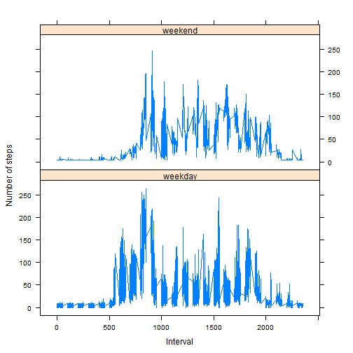

**Loading and preprocessing the data**

Code that is needed to

1. Load the data (i.e. read.csv())

2. Process/transform the data (if necessary) into a format suitable for your analysis

```r
activity_raw <- read.csv("activity.csv")

# Transform the date attribute to an actual date format
activity_raw$date <- as.POSIXct(activity_raw$date, format="%Y-%m-%d")

# Compute the weekdays from the date attribute
activity_raw <- data.frame(date=activity_raw$date, 
                           weekday=tolower(weekdays(activity_raw$date)), 
                           steps=activity_raw$steps, 
                           interval=activity_raw$interval)

# Compute the day type (weekend or weekday)
activity_raw <- cbind(activity_raw, 
                      daytype=ifelse(activity_raw$weekday == "saturday" | 
                                     activity_raw$weekday == "sunday", "weekend", 
                                     "weekday"))

# Create the final data.frame
activity <- data.frame(date=activity_raw$date, 
                       weekday=activity_raw$weekday, 
                       daytype=activity_raw$daytype, 
                       interval=activity_raw$interval,
                       steps=activity_raw$steps)
```

**What is mean total number of steps taken per day?**
(Ignore the missing values in the dataset)

1. Calculate the total number of steps taken per day

2. Make a histogram of the total number of steps taken each day

3. Calculate and report the mean and median of the total number of steps taken per day

```r
# Compute the total number of steps each day (NA values removed)
sum_data <- aggregate(activity$steps, by=list(activity$date), FUN=sum, na.rm=TRUE)
sum_data
```

```
##       Group.1     x
## 1  2012-10-01     0
## 2  2012-10-02   126
## 3  2012-10-03 11352
## 4  2012-10-04 12116
## 5  2012-10-05 13294
## 6  2012-10-06 15420
## 7  2012-10-07 11015
## 8  2012-10-08     0
## 9  2012-10-09 12811
## 10 2012-10-10  9900
## 11 2012-10-11 10304
## 12 2012-10-12 17382
## 13 2012-10-13 12426
## 14 2012-10-14 15098
## 15 2012-10-15 10139
## 16 2012-10-16 15084
## 17 2012-10-17 13452
## 18 2012-10-18 10056
## 19 2012-10-19 11829
## 20 2012-10-20 10395
## 21 2012-10-21  8821
## 22 2012-10-22 13460
## 23 2012-10-23  8918
## 24 2012-10-24  8355
## 25 2012-10-25  2492
## 26 2012-10-26  6778
## 27 2012-10-27 10119
## 28 2012-10-28 11458
## 29 2012-10-29  5018
## 30 2012-10-30  9819
## 31 2012-10-31 15414
## 32 2012-11-01     0
## 33 2012-11-02 10600
## 34 2012-11-03 10571
## 35 2012-11-04     0
## 36 2012-11-05 10439
## 37 2012-11-06  8334
## 38 2012-11-07 12883
## 39 2012-11-08  3219
## 40 2012-11-09     0
## 41 2012-11-10     0
## 42 2012-11-11 12608
## 43 2012-11-12 10765
## 44 2012-11-13  7336
## 45 2012-11-14     0
## 46 2012-11-15    41
## 47 2012-11-16  5441
## 48 2012-11-17 14339
## 49 2012-11-18 15110
## 50 2012-11-19  8841
## 51 2012-11-20  4472
## 52 2012-11-21 12787
## 53 2012-11-22 20427
## 54 2012-11-23 21194
## 55 2012-11-24 14478
## 56 2012-11-25 11834
## 57 2012-11-26 11162
## 58 2012-11-27 13646
## 59 2012-11-28 10183
## 60 2012-11-29  7047
## 61 2012-11-30     0
```

```r
# Rename the attributes
names(sum_data) <- c("date", "total")

# Compute the histogram of the total number of steps each day
hist(sum_data$total, 
     breaks=seq(from=0, to=25000, by=2500),
     col="blue", 
     xlab="Total number of steps", 
     ylim=c(0, 20), 
     main="Histogram of the total number of steps taken each day\n(NA removed)")
```

 

```r
# Compute mean and median total number of steps taken per day
mean(sum_data$total)
```

```
## [1] 9354.23
```

```r
median(sum_data$total)
```

```
## [1] 10395
```

**What is the average daily activity pattern?**

1. Make a time series plot (i.e. type = "l") of the 5-minute interval (x-axis) and the average number of steps taken, averaged across all days (y-axis)

2. Which 5-minute interval, on average across all the days in the dataset, contains the maximum number of steps?


```r
# Compute the means of steps accross all days for each interval
mean_data <- aggregate(activity$steps, 
                       by=list(activity$interval), 
                       FUN=mean, 
                       na.rm=TRUE)

# Rename the attributes
names(mean_data) <- c("interval", "mean")

# Compute the time series plot
plot(mean_data$interval, 
     mean_data$mean, 
     type="l", 
     col="blue", 
     lwd=2, 
     xlab="Interval [minutes]", 
     ylab="Average number of steps", 
     main="Time series of the average number of steps per intervals\n(NA removed)")
```

 

```r
# Position of the maximum mean
max_pos <- which(mean_data$mean == max(mean_data$mean))

# Interval that contains maximum mean
max_interval <- mean_data[max_pos, 1]
max_interval
```

```
## [1] 835
```

**Imputing missing values**

1. Calculate and report the total number of missing values in the dataset (i.e. the total number of rows with NAs)

2. Devise a strategy for filling in all of the missing values in the dataset. The strategy does not need to be sophisticated. For example, you could use the mean/median for that day, or the mean for that 5-minute interval, etc.

3. Create a new dataset that is equal to the original dataset but with the missing data filled in.

4. Make a histogram of the total number of steps taken each day and Calculate and report the mean and median total number of steps taken per day. Do these values differ from the estimates from the first part of the assignment? What is the impact of imputing missing data on the estimates of the total daily number of steps?


```r
# Total number of NAs
NA_count <- sum(is.na(activity$steps))
NA_count
```

```
## [1] 2304
```

```r
# Find the NA positions
na_pos <- which(is.na(activity$steps))

# Create a vector of means
mean_vec <- rep(mean(activity$steps, na.rm=TRUE), times=length(na_pos))

# Replace the NAs by the means
activity[na_pos, "steps"] <- mean_vec

# Compute the total number of steps each day (NA values removed)
sum_data <- aggregate(activity$steps, by=list(activity$date), FUN=sum)

# Rename the attributes
names(sum_data) <- c("date", "total")

# Compute the histogram of the total number of steps each day
hist(sum_data$total, 
     breaks=seq(from=0, to=25000, by=2500),
     col="blue", 
     xlab="Total number of steps", 
     ylim=c(0, 30), 
     main="Histogram of the total number of steps taken each day\n(NA replaced by mean value)")
```

 

```r
mean(sum_data$total)
```

```
## [1] 10766.19
```

```r
median(sum_data$total)
```

```
## [1] 10766.19
```

```r
# Values differ greatly from the estimates from the first part of the assignment. The impact of imputing the missing values is to have more data, hence to obtain a bigger mean and median value.
```

**Are there differences in activity patterns between weekdays and weekends?**

1. Create a new factor variable in the dataset with two levels - "weekday" and "weekend" indicating whether a given date is a weekday or weekend day.

2. Make a panel plot containing a time series plot (i.e. type = "l") of the 5-minute interval (x-axis) and the average number of steps taken, averaged across all weekday days or weekend days (y-axis). See the README file in the GitHub repository to see an example of what this plot should look like using simulated data.


```r
# The new factor variable "daytype" was already in the activity data frame
head(activity)
```

```
##         date weekday daytype interval   steps
## 1 2012-10-01  monday weekday        0 37.3826
## 2 2012-10-01  monday weekday        5 37.3826
## 3 2012-10-01  monday weekday       10 37.3826
## 4 2012-10-01  monday weekday       15 37.3826
## 5 2012-10-01  monday weekday       20 37.3826
## 6 2012-10-01  monday weekday       25 37.3826
```

```r
# Load the lattice graphical library
library(lattice)

# Compute the average number of steps taken, averaged across all daytype variable
mean_data <- aggregate(activity$steps, 
                       by=list(activity$daytype, 
                               activity$weekday, activity$interval), mean)

# Rename the attributes
names(mean_data) <- c("daytype", "weekday", "interval", "mean")

# Compute the time series plot
xyplot(mean ~ interval | daytype, mean_data, 
       type="l", 
       lwd=1, 
       xlab="Interval", 
       ylab="Number of steps", 
       layout=c(1,2))
```

 

